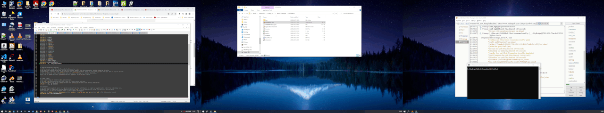

## AltTabMod Project Documentation

This project does amazing things. Here are some key features:
- Feature 1 Moves the Task Switcher (Alt+Tab) window to the monitor the mouse is on.
- Feature 2 Moves the selected program to the monitor the mouse is on.
- Feature 3 That is pretty much it. :)

For more information, downaload the [Docs](Docs.7z).

## Overview of what AltTabMod does!.
The TaskSwitcher (Alt Tab) window on MS Windows (10) will always spawn on the primary monitor. 
This can be very annoying if you have multiple monitors, esp if they are apart.  
So AltTabMod will move the TaskSwitcher (Alt Tab) window to the desktop the mouse is at. 
It will also bring the selected application to the desktop you are working on. 

#### !!!NOTE!!!
This programs needs to be run with admin permission.
This **program hooks into explorer.exe** and listen for a two events, when the Alt+tab window is created and destroyed. 
So keep that in mind. maybe you have some AV, or other policy's set that triggers something that prevents this code from running. 

## Known Limitations and Issues ####
- Can not detect a monitor that is off.
- Will not move fullscreen windows on purpose. 
  often fullscreen windows such as games, media centers etc are setup to be run on desired monitor. 
  in most cases moving them is not something you want to do. 
  This needs to be improved a bit because at the moment chrome in fullscreen (youtube). it doesnt move it. 
  So need a way to distinguish from programs that are fullscreen "windowed" or fullscreen exclusively. like a 3d games.
- When the mouse is not on the primary monitor, the TaskSwitcher can flicker for a short while. 
  This is because the TaskSwitcher is always spawned at the primary monitor before getting moved. 
- Monitors with different resolutions may have issues as its not fully tested.
- Will not work with the old ask style TaskSwitcher.

## How It Moves The Programs In (Alt+Tab).
Rules used for moving programs "so far.."
1. If the program is in full-screen mode. don't move it.
2. If the program is on the same screen as the monitor. don't move it.
3. If the program is maximized. maximize it on the target desktop as well.
4. If the program is bigger than the target monitor, set it to left,top pos and maximize it.
5. If the program is wider than the target monitor but the app area is smaller. set it to left,top pos of the monitor.
6. If the program is taller/higher than the target monitor but the app area is smaller. set it to left,top pos of the monitor.

## Tools used in this project.
gcc is used on windows, to be precise mingw. 
most of my gnu tools (gcc, make, etc) are installed by using [msys2](https://www.msys2.org/) 
i am not fully up todate on the latest stuff.  

gcc --version\n
gcc (Rev8, Built by MSYS2 project) 11.2.0 
Copyright (C) 2021 Free Software Foundation, Inc. 
This is free software; see the source for copying conditions.  There is NO 
warranty; not even for MERCHANTABILITY or FITNESS FOR A PARTICULAR PURPOSE.  

windres --version 
GNU windres (GNU Binutils) 2.3 
Copyright (C) 2021 Free Software Foundation, Inc. 
This program is free software; you may redistribute it under the terms of 
the GNU General Public License version 3 or (at your option) any later version. 
This program has absolutely no warranty.  
So if yours is newer than this. it should probably work fine..

## Compile the code!.
I have only built this on 64Bit Os. 
Build the code 
1. windres.exe -I ..\\AppDir -J rc -O coff -i resource.rc -o resource.res. 
2. gcc -o MyApp.exe main.c resource.res -lole32 -lpsapi (-ldwmapi)

To compile/run the program without the Console window, you probably need some extra flags. 
gcc -Wall -o MyApp.exe res.... -lole32 **-Wl, –subsystem,windows** 
Simple makefile example, check out the [makefile](makefile)  

For a 32bit build you might need to do some changes. 
Forexample you might need to add the flag **-F pe-i386** to windres. 
Also for Gcc you might need to use **-m32 -lmsimg32 -mwindows**. 
Although this is not tested so i cant verify.

## Run the program.
Just double click on it and it will run. 
If you want the program to automatically start when you login to the pc, you use google. :) 
There are tonz of guides on howto automatically start a program. 

## Background why i made this.
Im just a widapi noob hacking stuff together for my own needs. 
So in my setup, i have two monitors at my desk/bench. 
But i also have a tv attached to it a couple of meters away, by hdmi cable. 
And my primary desktop is of course on the 1st monitor, the others are just extended desktops. 
If i am in the sofa watching tv and i know ie, chrome is open on one of the monitors. 
Normally pressing ALt+Tab brings up the Alt+Tab Window on the monitor(Primary) and since it on the 1st monitor, i cant see it when sitting in the sofa. 
This has annoyed me for quite a bit, so i have put together something that works for me. 
I hope this also can be useful for other people with same annoyance. 
And perhaps help improve it as there is probably a better way to approach this. 

## Credits.
Some of the guys especially Grégori Macário Harbs also know was Mysoft from Irc. freenode/Libera #winapi 
I don't know who else, perhaps MS itself for the OS we use so much, and the guys who made the Tools i have used. 

## License 
Gnu Gpl V2. No discussion.

Best Regards.
